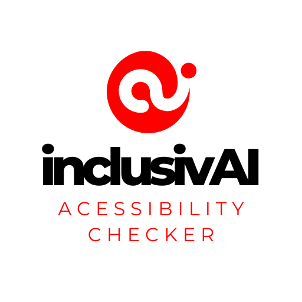

# InclusivAI: Accessibility Checker Tool

<div style="text-align: center;">
  
</div>

InclusivAI is a powerful tool designed to verify and improve accessibility for specific URLs, HTML, and PDF files. Leveraging Azure AI services, InclusivAI ensures compliance with major accessibility standards, including:

- **HTML**: WCAG (Web Content Accessibility Guidelines), ADA (Americans with Disabilities Act), and Section 508 (Rehabilitation Act).
- **PDF**: PDF/UA (ISO 14289-1).

InclusivAI uses cutting-edge technologies such as Azure OpenAI (GPT-4) for analysis and Azure Computer Vision for alternative text (alt) suggestions for images.

---

> ⚠ **Disclaimer**: This project uses Azure services, which may incur costs. Be sure to review Azure's pricing and monitor your resource usage to avoid unexpected charges.

---

## Table of Contents

1. [Features](#features)
2. [Architecture](#architecture)
3. [Getting Started](#getting-started)
4. [Azure Resource Setup](#azure-resource-setup)
5. [Local Development](#local-development)
6. [Deployment](#deployment)
7. [GitHub Actions for CI/CD](#github-actions-for-cicd)
8. [Authors](#authors)

---

## Features

- **AI-Powered Accessibility Analysis**:
  - HTML accessibility checks against WCAG, ADA, and Section 508 standards.
  - PDF validation against PDF/UA standards.
- **Azure OpenAI Integration**: Chat assistant for HTML and PDF analysis.
- **Azure Computer Vision**: Extracts and suggests alt texts for images.
- **Comprehensive Reports**: Generate actionable insights for accessibility improvements.

---

## Architecture

### Backend
- **Built with**: .NET 8
- **Deployed on**: Azure App Service
- **Key Modules**:
  - Accessibility analysis services
  - API controllers for frontend interaction

### Frontend
- **Built with**: React
- **Deployed on**: Azure Static Web Apps
- **Key Features**:
  - User-friendly interface for submitting URLs, HTML, and PDF files.
  - Displays detailed accessibility reports.

---

## Getting Started

Follow these steps to set up InclusivAI locally and deploy to Azure.

---

## Azure Resource Setup

### 1. Azure Computer Vision

#### Azure Portal:
1. Search for "Cognitive Services" in the Azure Portal.
2. Click "Create" and select **Computer Vision**.
3. Configure the resource and retrieve the API Key and Endpoint.

#### Azure CLI:
```bash
az cognitiveservices account create --name <name> \
  --resource-group <resource-group> --kind ComputerVision \
  --sku S1 --location <location>
```
Retrieve the API Key:
```bash
az cognitiveservices account keys list --name <name> --resource-group <resource-group>
```

---

### 2. Azure OpenAI Service

#### Azure Portal:
1. Search for **Azure OpenAI** in the Azure Portal.
2. Configure the service and retrieve the API Key and Endpoint.

#### Azure CLI:
```bash
az cognitiveservices account create --name <name> \
  --resource-group <resource-group> --kind OpenAI \
  --sku S1 --location <location>
```
Retrieve the API Key:
```bash
az cognitiveservices account keys list --name <name> --resource-group <resource-group>
```

---

### 3. Blob Storage

#### Azure Portal:
1. Create a new **Storage Account**.
2. Add a **Container** for storing reports and logs.

#### Azure CLI:
```bash
az storage account create --name <name> \
  --resource-group <resource-group> --sku Standard_LRS
az storage container create --account-name <name> --name <container-name>
```

---

### 4. Backend: Azure App Service

#### Azure Portal:
1. Create a new **App Service** and select **.NET 8** as the runtime.
2. Deploy the backend API.

#### Azure CLI:
```bash
az webapp create --name <app-name> --resource-group <resource-group> \
  --runtime "DOTNET|8" --plan <app-service-plan>
```

---

### 5. Frontend: Azure Static Web Apps

#### Azure Portal:
1. Create a new **Static Web App** and link your GitHub repository.

#### Azure CLI:
```bash
az staticwebapp create --name <static-web-app-name> \
  --resource-group <resource-group> --source <frontend-directory> \
  --location <location>
```

---

## Local Development

### Backend Setup
1. Navigate to the backend directory:
   ```bash
   cd backend
   ```
2. Restore dependencies:
   ```bash
   dotnet restore
   ```
3. Add Azure service keys to `appsettings.json`.
4. Run the application:
   ```bash
   dotnet run
   ```
5. Run tests:
   ```bash
   dotnet test
   ```

### Frontend Setup
1. Navigate to the frontend directory:
   ```bash
   cd frontend
   ```
2. Install dependencies:
   ```bash
   npm install
   ```
3. Add backend API URL to `.env`.
4. Start the development server:
   ```bash
   npm start
   ```
5. Run tests:
   ```bash
   npm test
   ```

---

## Deployment

### Backend Deployment
1. Publish the backend:
   ```bash
   dotnet publish -c Release -o ./publish
   ```
2. Deploy to Azure:
   ```bash
   az webapp deploy --name <app-name> --resource-group <resource-group> --src-path ./publish
   ```

### Frontend Deployment
1. Build the frontend:
   ```bash
   npm run build
   ```
2. Deploy to Azure:
   ```bash
   az staticwebapp upload --name <static-web-app-name> --resource-group <resource-group> --source ./build
   ```

---

## GitHub Actions for CI/CD

### Backend Workflow
Automate backend deployment using GitHub Actions.

```yaml
name: Deploy Backend
on:
  push:
    branches:
      - main
jobs:
  build-and-deploy:
    runs-on: ubuntu-latest
    steps:
    - uses: actions/checkout@v2
    - name: Setup .NET
      uses: actions/setup-dotnet@v3
      with:
        dotnet-version: '8.0.x'
    - name: Build
      run: dotnet build
    - name: Deploy to Azure
      run: az webapp deploy --name <app-name> --resource-group <resource-group> --src-path ./publish
```

### Frontend Workflow
Automate frontend deployment using GitHub Actions.

```yaml
name: Deploy Frontend
on:
  push:
    branches:
      - main
jobs:
  build-and-deploy:
    runs-on: ubuntu-latest
    steps:
    - uses: actions/checkout@v2
    - name: Install Node.js
      uses: actions/setup-node@v3
      with:
        node-version: '16'
    - name: Install dependencies
      run: npm install
    - name: Build
      run: npm run build
    - name: Deploy to Azure
      run: az staticwebapp upload --name <static-web-app-name> --resource-group <resource-group> --source ./build
```

---

## Authors

- **Fermin Piccolo**
  - [GitHub](https://github.com/frmpiccolo)
  - [LinkedIn](https://www.linkedin.com/in/ferminpiccolo/)


---

> ⚠ **Disclaimer**: This project uses Azure services, which may incur costs. Be sure to review Azure's pricing and monitor your resource usage to avoid unexpected charges.

---
